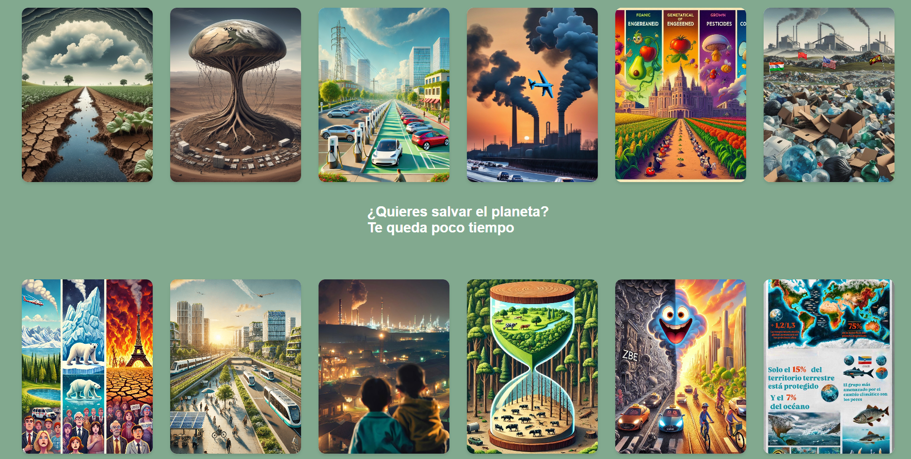

# Climate Change: An Educommunicative Analysis
## Overview
 

This is a digital work funded by Amazon Future Engineers as part of the Meet and Code: Code for the Planet 2024 program and the European Union's Code Week through the Asociación de Jóvenes Profesionales
por el Patrimonio Cultural Cultural Heritage (AJPC). It is based on 12 educommunicative audiovisual projects aimed at media literacy on various aspects of climate change. 
These projects were created by Group A students from the "Education and Audiovisual Media" course in the third year of the Journalism Degree at Complutense University of Madrid 
during the first semester of the 2024-2025 academic year, under the coordination of Professor Raúl Gómez Hernández. 
This work draws inspiration from the futuristic vision presented in [Pig City](https://www.mvrdv.com/projects/134/pig-city) by MVRDV studio, which was showcased in the 
[Banquete 03 program by Medialab Madrid](https://archivomedialabmadrid.org/pdfjs/web/viewer.html?file=https://archivomedialabmadrid.org/wp-content/uploads/2024/04/MLM_MVRDV_esp_snp_crr.pdf).

This student-produced digital work, coordinated by faculty, consists of a structured piece designed with CSS flip cards containing AI-generated posters, infographics, and teasers about their research topics. 
In these creations, students compared past data with current information, made future predictions, and proposed possible solutions.

During the process, student groups extracted open-access data from NGOs, international institutions, or research centers such as the Food and Agriculture Organization (FAO), World Wildlife Fund (WWF), 
or Eurostat. They focused on topics such as arable land and consumption patterns, Earth's resources, demographic challenges, and biodiversity. They created data visualizations using open-source software
and developed AI-generated visualizations. Throughout the project, students acquired new technological skills and critical analysis abilities, learned about AI ethics, forecast generation, creativity in 
scientific communication, and participated in workshops led by artists on creativity in art and citizen laboratory practices.

The digital work can be accessed at this link: https://raulgo04.github.io/ObraMAE24/assets/html/index.html

 

## Topics
 

**Food**

1. Arable land, Earth's population distribution, and climate change  
2. Types of food cultivation (organic, genetically modified (GMOs), pesticide-grown), climate change, and consumption habits  
3. Livestock models, climate change, and consumption habits  

**Fuels**

1. Greenhouse gas emissions into the atmosphere and global warming  
2. Impact of fossil fuels on global warming and consumer opinions on renewable energies  
3. Waste collection and treatment processes: impact and consumer habits  

**Transportation**

1. Impact of Low Emission Zones on air pollution  
2. Electric vehicles and consumption habits (car registrations, opinions, trends, etc.)  
3. Types of transportation: public (buses, metro systems, rental bicycles, etc.) vs private transportation. Habits and impact  

**Sustainability**

1. Availability of Earth's resources and population distribution (water, minerals, food production countries' relation to hunger issues)  
2. Biodiversity and climate change (species extinction threats, rising sea levels, forest surface area reduction)  
3. Energy efficiency, climate change, and consumption habits  
4. Citizens' attitudes toward climate change  

 

## Acknowledgments

- To all participating third-year Journalism Degree students at Complutense University of Madrid enrolled in the "Education and Audiovisual Media" course during the first semester of 2024-2025.
- To Elisa Cuesta and David Mingorance for their assistance during the practical class on creative data visualization.
- To Amazon Future Engineers for funding this work as part of Meet and Code: Code for the Planet 2024 program and the European Union's Code Week through the Asociación de Jóvenes Profesionales por el Patrimonio Cultural (AAJPC).
- To the entire team behind the project "Scientists in Art and Artists in Science: Historical Milestones in Medialab Madrid's Archive Through an Exhibition Proposal" (FCT-22-17889) for allowing us to showcase this work during its exhibition at the Faculty of Fine Arts in April-May 2025.

 

## License

**CC-BY 4.0.** Read the  [License.md](License.md) file for more details about this license.
