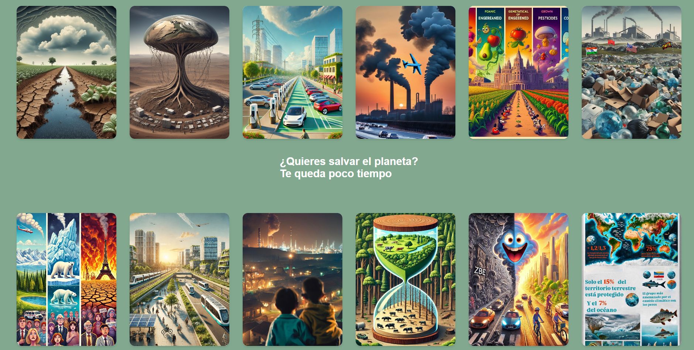

# Cambio climático: un análisis educomunicativo
## Descripción general
 

Es una obra digital, financiada por Amazon Future Engineers dentro del programa Meet and Code: Code for the Planet 2024 y de la Code Week de la Unión Europea a través de la Asociación de Jóvenes Profesionales por el Patrimonio Cultural (AJPC), apartir de 12 proyectos educomunicativos audiovisuales para la alfabetización mediática sobre diferentes aspectos del cambio climático realizados por el grupo de estudiantes (A) de la asignatura de Educación y Medios Audiovisuales de 3er curso del Grado de Periodismo de la Universidad Complutense de Madrid durante el primer cuatrimestre del curso 2024-2025 bajo la coordinación del profesor Raúl Gómez Hernández. Esta obra emana de la visión futurista que mostraba la obra de [Pig City](https://www.mvrdv.com/projects/134/pig-city) del estudio MVRDV y que se expuso en el programa [Banquete 03 de Medialab Madrid](https://archivomedialabmadrid.org/pdfjs/web/viewer.html?file=https://archivomedialabmadrid.org/wp-content/uploads/2024/04/MLM_MVRDV_esp_snp_crr.pdf)

Esta obra digital producida por los estudiantes y coordinada se compone de una obra estructurada en flip cards diseñadas en CSS contienen carteles generados por IA, infografías y teasers sobre sus temas de investigación. En estas creaciones, compararon datos del pasado con información actual e hicieron predicciones de futuro y posibles soluciones.

Los grupos de estudiantes durante el proceso extrajeron datos de libre acceso de ONG, instituciones internacionales o centros de investigación como la Organización de las Naciones Unidas para la Agricultura y la Alimentación, el Fondo Mundial para la Naturaleza o la Eurostat sobre temas como la tierra cultivable y los patrones de consumo, los recursos de la Tierra y los retos demográficos o de biodiversidad, crearon visualizaciones de datos utilizando software de código abierto y desarrollaron visualizaciones generadas por Inteligencia Artificial (IA). Durante el proyecto, también adquirieron nuevas habilidades tecnológicas y análisis crítico de las mismas, aprendieron sobre ética en la IA, generación de pronósticos, uso de la creatividad en la comunicación científica, y participaron en talleres desarrollados por artistas sobre creatividad en el arte y prácticas de laboratorio ciudadano.

La obra puede ser consultada en este enlace: https://raulgo04.github.io/ObraMAE24/assets/html/index.html

 

## Temas
 

**Alimentación**

  1. Tierras cultivables, poblamiento de la Tierra y cambio climático
  2. Tipo de cultivo de alimentos (ecológicos, transgénicos (AMG) y crecidos con pesticidas), cambio climático y hábitos de consumo.
  3. Modelos de ganadería, cambio climático y hábitos de consumo.
 

**Combustibles**

1. Emisiones de gases efecto invernadero a la atmósfera y calentamiento global 
2. Impacto de los combustibles fósiles en el calentamiento global y consumo y opinion de las energias renovables
3. Proceso de recogida y tratamiento de residuos: impacto y hábitos de los consumidores

**Transportes**

1. Impacto de las Zonas de Bajas Emisiones en la contaminación del aire
2. Vehículos eléctricos y hábitos de consumo (matriculaciones de turismos, opiniones, tendencias etc.)
3. Tipo de transporte: público (autobuses, metro, bicicleta de alquiler etc) y privado. Hábitos e impacto.

**Sostenibilidad**

1. Disponibilidad de recursos de la Tierra y poblamiento (agua, minerales, alimentos y países productores relación con hambre etc)
2. Biodiversidad y cambio climático (desaparición de especies, peligro de extinción etc., subida del nivel del mar, superficie forestal etc.)
3. Eficiencia energética, cambio climático y hábitos de consumo
4. Actitud de los ciudadanos ante el cambio climático 

 

## Agradecimiento
 

- A todos los alumnos participantes de 3er curso del Grado de Periodismo de la Universidad Complutense de Madrid de la asignatura de Educación y Medios Audiovisuales durante el primer cuatrimestre del curso 2024-2025.
- A Elisa Cuesta y David Mingorance por la ayuda prestada durante la clase práctica sobre visualización de datos creativa.
- A Amazon Future Engineers por la financiación para la obra dentro del programa Meet and Code: Code for the Planet 2024 y de la Code Week de la Unión Europea a través de la Asociación de Jóvenes Profesionales por el Patrimonio Cultural (AJPC)
- A todo el equipo del proyecto Científicos en las artes y artistas en la ciencia: hitos históricos en el archivo de MediaLab Madrid a través de una propuesta expositiva y educativa (FCT-22-17889) por permitirnos exponer la obra durante la exposición en la Facultad de Bellas Artes en abril y mayo de 2025.

 

## Licencia

**CC-BY 4.0.**Lea el archivo [License.md](License.md) para saber más especificaciones sobre ella.
